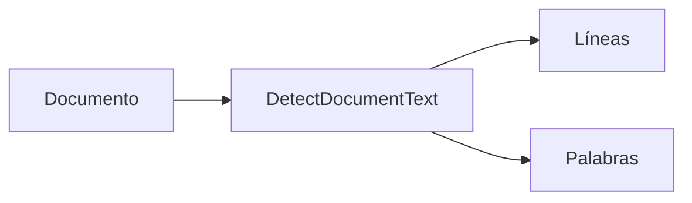
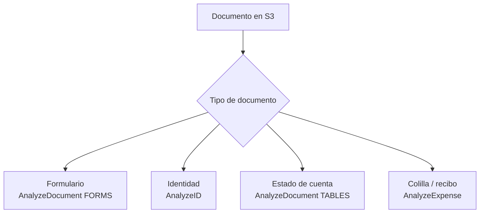

# Clase 2: Formularios, identidades, tablas y documentos financieros

| | |
|---|---|
| **Clase** | 2 de 11 |
| **Duración** | 3 horas |
| **Controlador** | `Clase02Controller` |
| **Endpoints** | `POST /modulo1/clase02/textract/form`, `POST /modulo1/clase02/textract/id`, `POST /modulo1/clase02/textract/statement`, `POST /modulo1/clase02/textract/payslip` |

## Objetivos

Al terminar esta sesión podrás:

- Elegir la operación correcta de Textract según el tipo de documento.
- Extraer pares clave-valor de formularios bancarios.
- Procesar documentos de identidad con `AnalyzeID`.
- Extraer tablas desde estados de cuenta.
- Extraer campos principales de una colilla de pago o recibo con `AnalyzeExpense`.
- Proteger todos los endpoints con la misma API key/secret de la clase 1.

---

## Parte teórica

### De texto plano a datos estructurados

En la clase 1 usamos `DetectDocumentText`. Esa operación responde principalmente con líneas y palabras:



En crédito necesitamos más que texto. Necesitamos campos:

- nombre del solicitante;
- número de documento;
- ingreso neto;
- monto solicitado;
- movimientos de una tabla;
- empleador;
- descuentos.

Para eso usamos operaciones más especializadas:



### Bloques y relaciones

Textract devuelve un JSON con bloques. Algunos bloques tienen texto directo y otros se conectan con relaciones.

| Bloque | Qué representa | Uso |
|--------|----------------|-----|
| `PAGE` | Página del documento | Agrupar contenido |
| `LINE` | Línea de texto | Texto legible |
| `WORD` | Palabra individual | Construir texto de campos |
| `KEY_VALUE_SET` | Etiqueta o valor | Formularios |
| `TABLE` | Tabla completa | Estados de cuenta |
| `CELL` | Celda de tabla | Filas y columnas |

Idea clave:

> Textract detecta piezas del documento. Nuestro código convierte esas piezas en JSON útil para la API.

### Qué operación usamos en cada caso

| Documento | Operación Textract | Endpoint del curso |
|-----------|--------------------|--------------------|
| Solicitud de crédito | `AnalyzeDocument` con `FORMS` | `POST /modulo1/clase02/textract/form` |
| Documento de identidad | `AnalyzeID` | `POST /modulo1/clase02/textract/id` |
| Estado de cuenta | `AnalyzeDocument` con `TABLES` | `POST /modulo1/clase02/textract/statement` |
| Colilla de pago / recibo | `AnalyzeExpense` | `POST /modulo1/clase02/textract/payslip` |

### Confianza

Textract incluye `Confidence`, un valor de 0 a 100. No significa que el dato sea verdadero; significa que Textract estima que leyó bien esa parte del documento.

| Confianza | Interpretación práctica |
|-----------|-------------------------|
| `>= 90` | Lectura fuerte |
| `80 - 89` | Revisar si el dato es crítico |
| `< 80` | Pedir validación humana o nuevo escaneo |

En crédito, un monto o ingreso con baja confianza no debería pasar automáticamente a un modelo.

---

## Parte práctica

Trabaja sobre tu repo **esqueleto**. Esta clase asume que ya terminaste la Clase 1:

- `AuthModule` y `ApiKeyGuard` funcionan.
- `Clase01Controller` está protegido.
- `TextractService` existe en `src/modulo1/clase01/textract.service.ts`.
- `Modulo1Module` ya importa `AuthModule`.
- Ya tienes `.env` con `AWS_REGION`, `AWS_ACCESS_KEY_ID`, `AWS_SECRET_ACCESS_KEY` y `AWS_S3_BUCKET`.

Todos los endpoints nuevos usarán las cabeceras:

```txt
x-api-key: test1
x-api-secret: pass1
```

### 0. Previo: prueba la API con Docker

Antes de crear los endpoints de Clase 2, verifica que el proyecto también corre dentro de Docker. Hasta ahora probaste con `npm run start:dev`; ahora la API debe levantar en un contenedor.

#### 0.1. Crea o actualiza `Dockerfile`

Archivo: `Dockerfile`

```dockerfile
FROM node:20-alpine

WORKDIR /app

COPY package*.json ./
RUN npm ci

COPY . .

RUN npm run build

EXPOSE 3000

CMD ["npm", "run", "start:prod"]
```

#### 0.2. Crea o actualiza `.dockerignore`

Archivo: `.dockerignore`

```txt
node_modules
dist
.git
.env
*.log
```

#### 0.3. Crea o actualiza `docker-compose.yml`

Archivo: `docker-compose.yml`

```yaml
services:
  api:
    build:
      context: .
      dockerfile: Dockerfile
    ports:
      - "3000:3000"
    env_file:
      - .env
    environment:
      PORT: 3000
```

#### 0.4. Construye y levanta el contenedor

```bash
docker compose build
docker compose up
```

Si prefieres dejarlo corriendo en segundo plano:

```bash
docker compose up -d
docker compose logs -f api
```

#### 0.5. Prueba que responde

En otra terminal:

```bash
curl http://localhost:3000/health
```

También prueba el endpoint autenticado de la Clase 1:

```bash
curl -H "x-api-key: test1" \
  -H "x-api-secret: pass1" \
  http://localhost:3000/modulo1/clase01/test
```

Respuesta esperada:

```txt
endpoint test autenticado
```

No continúes con los endpoints de Clase 2 hasta que la API responda correctamente desde Docker.

Para apagar:

```bash
docker compose down
```

### 0.6. Publica la API en Render

Después de confirmar que Docker funciona en tu máquina, publica la misma API en Render para tener una URL pública.

#### Crear cuenta en Render

1. Entra a [https://render.com](https://render.com).
2. Crea una cuenta con tu correo o con GitHub.
3. Entra al dashboard de Render.
4. Conecta tu cuenta de GitHub cuando Render lo solicite.

#### Sube tu proyecto a GitHub

Si todavía no tienes el esqueleto en un repo propio:

```bash
git init
git add .
git commit -m "initial course api"
git branch -M main
git remote add origin https://github.com/TU_USUARIO/TU_REPO.git
git push -u origin main
```

Si ya tenías repo:

```bash
git add .
git commit -m "add docker setup"
git push origin main
```

#### Crea el servicio en Render

1. En Render, elige **New** → **Web Service**.
2. Selecciona tu repositorio de GitHub.
3. Usa esta configuración:

| Campo | Valor |
|-------|-------|
| Name | `api-credito-tu-nombre` |
| Runtime / Language | Docker |
| Branch | `main` |
| Dockerfile Path | `Dockerfile` |
| Instance Type | Free o el plan indicado por el docente |
| Health Check Path | `/health` |

Render usará el `Dockerfile` de tu repo. No usa `docker-compose.yml`; ese archivo es solo para tu máquina.

#### Configura variables de entorno

En tu servicio de Render, entra a **Environment** y agrega las mismas variables de tu `.env`:

```env
NODE_ENV=production
AWS_REGION=us-east-1
AWS_ACCESS_KEY_ID=
AWS_SECRET_ACCESS_KEY=
AWS_S3_BUCKET=
DATABASE_URL=
DATABASE_SCHEMA=
SEED_API_KEY=test1
SEED_API_SECRET=pass1
```

No subas tu archivo `.env` a GitHub. Las claves y secretos van solo en Render.

No necesitas definir `PORT` manualmente en Render; Render lo define automáticamente y el proyecto ya lo lee en `main.ts`.

Antes del primer despliegue, asegúrate de haber ejecutado las migraciones y el seed contra esa misma base:

```bash
npm run migration:run
npm run seed:api-client
```

#### Prueba la API publicada

Cuando Render termine el deploy, copia tu URL pública, por ejemplo:

```txt
https://api-credito-tu-nombre.onrender.com
```

Prueba el health check:

```bash
curl https://api-credito-tu-nombre.onrender.com/health
```

Prueba el endpoint autenticado de Clase 1:

```bash
curl -H "x-api-key: test1" \
  -H "x-api-secret: pass1" \
  https://api-credito-tu-nombre.onrender.com/modulo1/clase01/test
```

Respuesta esperada:

```txt
endpoint test autenticado
```

En el plan gratuito, la primera petición puede tardar por cold start. Si falla, revisa **Logs** y **Events** dentro del servicio en Render.

Más detalle: revisa `DEPLOY.md` en la raíz del esqueleto.

### 1. Sube documentos de prueba a S3

Sube a tu bucket documentos ficticios o de laboratorio:

```txt
solicitud-credito.pdf
carnet-demo.jpg
estado-cuenta.pdf
boleta-pago.pdf
```

En los endpoints enviaremos solo la clave del objeto:

```json
{
  "fileName": "solicitud-credito.pdf"
}
```

### 2. Extiende `TextractService`

Archivo: `src/modulo1/clase01/textract.service.ts`

Mantén lo que ya hiciste en la Clase 1 y añade los imports nuevos:

```typescript
import {
  AnalyzeDocumentCommand,
  AnalyzeExpenseCommand,
  AnalyzeIDCommand,
  DetectDocumentTextCommand,
  TextractClient,
  UnsupportedDocumentException,
} from '@aws-sdk/client-textract';
```

Dentro de la clase `TextractService`, debajo de `detectDocumentText(...)`, añade estos métodos:

```typescript
  async analyzeForm(s3Key: string) {
    return this.analyzeDocument(s3Key, ['FORMS']);
  }

  async analyzeStatement(s3Key: string) {
    return this.analyzeDocument(s3Key, ['TABLES']);
  }

  async analyzeId(s3Key: string) {
    this.assertSupportedFormat(s3Key);

    const command = new AnalyzeIDCommand({
      DocumentPages: [
        {
          S3Object: {
            Bucket: this.config.getOrThrow<string>('AWS_S3_BUCKET'),
            Name: s3Key,
          },
        },
      ],
    });

    return await this.client.send(command);
  }

  async analyzeExpense(s3Key: string) {
    this.assertSupportedFormat(s3Key);

    const command = new AnalyzeExpenseCommand({
      Document: {
        S3Object: {
          Bucket: this.config.getOrThrow<string>('AWS_S3_BUCKET'),
          Name: s3Key,
        },
      },
    });

    return await this.client.send(command);
  }

  private async analyzeDocument(
    s3Key: string,
    featureTypes: ('FORMS' | 'TABLES')[],
  ) {
    this.assertSupportedFormat(s3Key);

    const command = new AnalyzeDocumentCommand({
      Document: {
        S3Object: {
          Bucket: this.config.getOrThrow<string>('AWS_S3_BUCKET'),
          Name: s3Key,
        },
      },
      FeatureTypes: featureTypes,
    });

    try {
      return await this.client.send(command);
    } catch (error) {
      if (error instanceof UnsupportedDocumentException) {
        throw new BadRequestException(
          'Unsupported document format for Textract. Use PDF, PNG, JPEG, or TIFF.',
        );
      }
      throw error;
    }
  }
```

### 3. Crea el service de Clase 2

Crea la carpeta:

```txt
src/modulo1/clase02/
```

Archivo: `src/modulo1/clase02/clase02.service.ts`

```typescript
import { Injectable } from '@nestjs/common';
import { Block } from '@aws-sdk/client-textract';
import { TextractService } from '../clase01/textract.service';

type FieldResult = {
  field: string;
  value: string;
  confidence: number;
};

type TableResult = {
  rows: string[][];
};

@Injectable()
export class Clase02Service {
  constructor(private readonly textract: TextractService) {}

  async analyzeForm(body: { fileName: string }) {
    const response = await this.textract.analyzeForm(body.fileName);
    const fields = this.parseKeyValues(response.Blocks ?? []);

    return {
      fileName: body.fileName,
      fieldCount: fields.length,
      fields,
    };
  }

  async analyzeId(body: { fileName: string }) {
    const response = await this.textract.analyzeId(body.fileName);
    const fields = (response.IdentityDocuments ?? [])
      .flatMap((document) => document.IdentityDocumentFields ?? [])
      .map((field) => ({
        field: field.Type?.Text ?? 'UNKNOWN',
        value: field.ValueDetection?.Text ?? '',
        confidence: field.ValueDetection?.Confidence ?? 0,
      }))
      .filter((field) => field.value);

    return {
      fileName: body.fileName,
      fieldCount: fields.length,
      fields,
    };
  }

  async analyzeStatement(body: { fileName: string }) {
    const response = await this.textract.analyzeStatement(body.fileName);
    const tables = this.parseTables(response.Blocks ?? []);

    return {
      fileName: body.fileName,
      tableCount: tables.length,
      tables,
    };
  }

  async analyzePayslip(body: { fileName: string }) {
    const response = await this.textract.analyzeExpense(body.fileName);
    const documents = response.ExpenseDocuments ?? [];

    const summary = documents.flatMap((document) =>
      (document.SummaryFields ?? []).map((field) => ({
        field: field.Type?.Text ?? field.LabelDetection?.Text ?? 'UNKNOWN',
        label: field.LabelDetection?.Text ?? '',
        value: field.ValueDetection?.Text ?? '',
        confidence: field.ValueDetection?.Confidence ?? 0,
      })),
    );

    const lineItems = documents.flatMap((document) =>
      (document.LineItemGroups ?? []).flatMap((group) =>
        (group.LineItems ?? []).map((item) =>
          (item.LineItemExpenseFields ?? []).map((field) => ({
            field: field.Type?.Text ?? field.LabelDetection?.Text ?? 'UNKNOWN',
            label: field.LabelDetection?.Text ?? '',
            value: field.ValueDetection?.Text ?? '',
            confidence: field.ValueDetection?.Confidence ?? 0,
          })),
        ),
      ),
    );

    return {
      fileName: body.fileName,
      summary,
      lineItems,
    };
  }

  private parseKeyValues(blocks: Block[]): FieldResult[] {
    const blockMap = new Map<string, Block>();
    for (const block of blocks) {
      if (block.Id) {
        blockMap.set(block.Id, block);
      }
    }

    const keyBlocks = blocks.filter(
      (block) =>
        block.BlockType === 'KEY_VALUE_SET' &&
        block.EntityTypes?.includes('KEY'),
    );

    return keyBlocks
      .map((keyBlock) => {
        const valueBlock = this.findValueBlock(keyBlock, blockMap);

        return {
          field: this.getTextFromBlock(keyBlock, blockMap),
          value: valueBlock ? this.getTextFromBlock(valueBlock, blockMap) : '',
          confidence: Math.min(
            keyBlock.Confidence ?? 0,
            valueBlock?.Confidence ?? keyBlock.Confidence ?? 0,
          ),
        };
      })
      .filter((item) => item.field || item.value);
  }

  private findValueBlock(keyBlock: Block, blockMap: Map<string, Block>) {
    const valueRelation = keyBlock.Relationships?.find(
      (relationship) => relationship.Type === 'VALUE',
    );
    const valueId = valueRelation?.Ids?.[0];
    return valueId ? blockMap.get(valueId) : undefined;
  }

  private parseTables(blocks: Block[]): TableResult[] {
    const blockMap = new Map<string, Block>();
    for (const block of blocks) {
      if (block.Id) {
        blockMap.set(block.Id, block);
      }
    }

    return blocks
      .filter((block) => block.BlockType === 'TABLE')
      .map((table) => {
        const childIds =
          table.Relationships?.find((relationship) => relationship.Type === 'CHILD')
            ?.Ids ?? [];

        const cells = childIds
          .map((id) => blockMap.get(id))
          .filter((block): block is Block => block?.BlockType === 'CELL')
          .sort(
            (a, b) =>
              (a.RowIndex ?? 0) - (b.RowIndex ?? 0) ||
              (a.ColumnIndex ?? 0) - (b.ColumnIndex ?? 0),
          );

        const rows: string[][] = [];
        for (const cell of cells) {
          const rowIndex = (cell.RowIndex ?? 1) - 1;
          const columnIndex = (cell.ColumnIndex ?? 1) - 1;
          rows[rowIndex] ??= [];
          rows[rowIndex][columnIndex] = this.getTextFromBlock(cell, blockMap);
        }

        return { rows };
      });
  }

  private getTextFromBlock(block: Block, blockMap: Map<string, Block>): string {
    const childIds =
      block.Relationships?.find((relationship) => relationship.Type === 'CHILD')
        ?.Ids ?? [];

    return childIds
      .map((id) => blockMap.get(id))
      .filter((child): child is Block => Boolean(child))
      .map((child) => {
        if (child.BlockType === 'WORD') {
          return child.Text ?? '';
        }
        if (
          child.BlockType === 'SELECTION_ELEMENT' &&
          child.SelectionStatus === 'SELECTED'
        ) {
          return 'X';
        }
        return '';
      })
      .filter(Boolean)
      .join(' ');
  }
}
```

### 4. Crea el controller de Clase 2

Archivo: `src/modulo1/clase02/clase02.controller.ts`

```typescript
import { Body, Controller, Post, UseGuards } from '@nestjs/common';
import { ApiKeyGuard } from '../../auth/guards/api-key.guard';
import { Clase02Service } from './clase02.service';

@Controller('modulo1/clase02')
@UseGuards(ApiKeyGuard)
export class Clase02Controller {
  constructor(private readonly clase02: Clase02Service) {}

  @Post('textract/form')
  async analyzeForm(@Body() body: { fileName: string }) {
    return await this.clase02.analyzeForm(body);
  }

  @Post('textract/id')
  async analyzeId(@Body() body: { fileName: string }) {
    return await this.clase02.analyzeId(body);
  }

  @Post('textract/statement')
  async analyzeStatement(@Body() body: { fileName: string }) {
    return await this.clase02.analyzeStatement(body);
  }

  @Post('textract/payslip')
  async analyzePayslip(@Body() body: { fileName: string }) {
    return await this.clase02.analyzePayslip(body);
  }
}
```

### 5. Actualiza `Modulo1Module`

Archivo: `src/modulo1/modulo1.module.ts`

Mantén lo que ya tenías de Clase 1 y agrega `Clase02Controller` y `Clase02Service`.

```typescript
import { Module } from '@nestjs/common';
import { TypeOrmModule } from '@nestjs/typeorm';
import { AuthModule } from '../auth/auth.module';
import { RawDocumentText } from '../entities/raw-document-text.entity';
import { Clase01Controller } from './clase01/clase01.controller';
import { Clase01Service } from './clase01/clase01.service';
import { TextractService } from './clase01/textract.service';
import { Clase02Controller } from './clase02/clase02.controller';
import { Clase02Service } from './clase02/clase02.service';

@Module({
  imports: [AuthModule, TypeOrmModule.forFeature([RawDocumentText])],
  controllers: [Clase01Controller, Clase02Controller],
  providers: [Clase01Service, Clase02Service, TextractService],
})
export class Modulo1Module {}
```

### 6. Prueba los endpoints

Todos los comandos deben enviar `x-api-key` y `x-api-secret`.

#### Formulario

```bash
curl -X POST http://localhost:3000/modulo1/clase02/textract/form \
  -H "Content-Type: application/json" \
  -H "x-api-key: test1" \
  -H "x-api-secret: pass1" \
  -d '{ "fileName": "solicitud-credito.pdf" }'
```

#### Documento de identidad

```bash
curl -X POST http://localhost:3000/modulo1/clase02/textract/id \
  -H "Content-Type: application/json" \
  -H "x-api-key: test1" \
  -H "x-api-secret: pass1" \
  -d '{ "fileName": "carnet-demo.jpg" }'
```

#### Estado de cuenta

```bash
curl -X POST http://localhost:3000/modulo1/clase02/textract/statement \
  -H "Content-Type: application/json" \
  -H "x-api-key: test1" \
  -H "x-api-secret: pass1" \
  -d '{ "fileName": "estado-cuenta.pdf" }'
```

#### Colilla de pago

```bash
curl -X POST http://localhost:3000/modulo1/clase02/textract/payslip \
  -H "Content-Type: application/json" \
  -H "x-api-key: test1" \
  -H "x-api-secret: pass1" \
  -d '{ "fileName": "boleta-pago.pdf" }'
```

### 7. Entrega

- Prueba al menos dos endpoints con Postman o curl.
- Identifica un campo con `confidence < 80`.
- Explica en 3 a 5 líneas si ese campo debería pasar automáticamente o requerir revisión humana.

## Recursos

- [AnalyzeDocument](https://docs.aws.amazon.com/textract/latest/dg/API_AnalyzeDocument.html)
- [AnalyzeID](https://docs.aws.amazon.com/textract/latest/dg/API_AnalyzeID.html)
- [AnalyzeExpense](https://docs.aws.amazon.com/textract/latest/dg/API_AnalyzeExpense.html)
- [Bloques y relaciones](https://docs.aws.amazon.com/textract/latest/dg/how-it-works.html)
