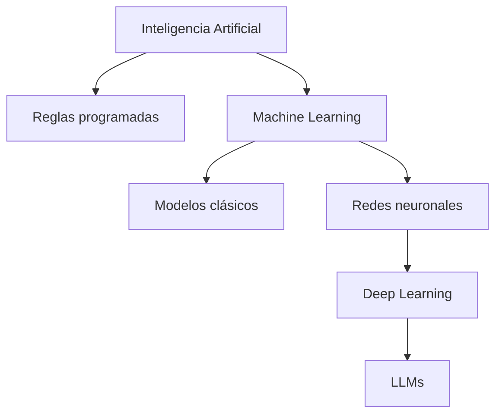
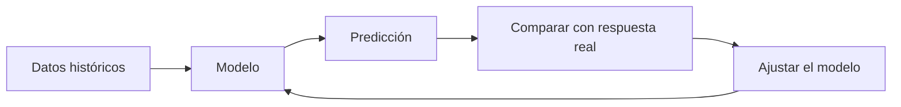
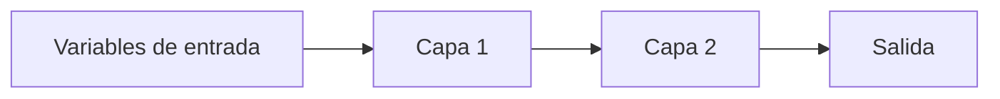
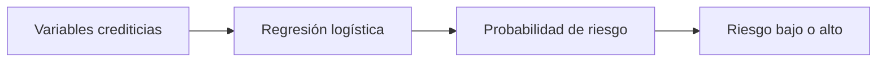
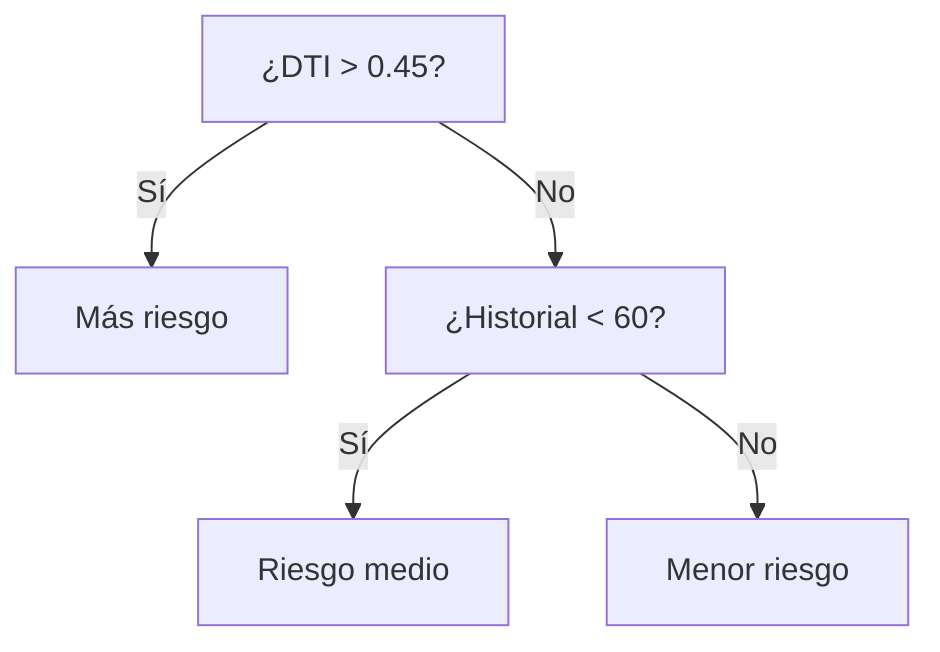
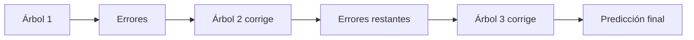
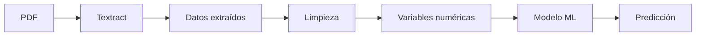
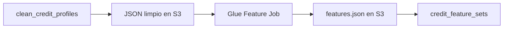

# Clase 5: IA, Machine Learning y variables para modelos crediticios

| | |
|---|---|
| **Clase** | 5 de 11 |
| **Duración** | 3 horas |
| **Tema principal** | De datos limpios a variables listas para modelos |
| **Práctica** | Notebook local con Docker y feature engineering con Glue |
| **Endpoints objetivo** | `POST /modulo1/clase05/credit-files/features`, `GET /modulo1/clase05/credit-files/:applicationId/features-status`, `GET /modulo1/clase05/credit-files/:applicationId/features` |

## Objetivos

Al terminar esta sesión podrás:

- Explicar con palabras simples qué es inteligencia artificial.
- Diferenciar inteligencia artificial, machine learning, redes neuronales y LLMs.
- Entender cómo aprende un modelo clásico de machine learning.
- Probar un ejemplo pequeño de regresión logística en un notebook local con Docker.
- Entender por qué necesitamos crear variables numéricas antes de entrenar modelos.
- Generar variables crediticias desde el perfil limpio de Clase 4.

---

## Parte teórica

### 1. Qué es inteligencia artificial

Inteligencia artificial, o IA, es una forma de construir sistemas que hacen tareas que normalmente asociamos con inteligencia humana.

No significa que la computadora "piense" como una persona. Significa que puede resolver tareas como:

- reconocer una imagen;
- leer un documento;
- responder una pregunta;
- clasificar un correo como spam;
- recomendar una película;
- estimar el riesgo de una solicitud de crédito.

Un ejemplo muy simple:

```txt
Entrada: "Este correo promete dinero fácil y pide hacer clic"
Sistema: detecta patrones sospechosos
Salida: "Probablemente es spam"
```

Otro ejemplo:

```txt
Entrada: foto de una cédula
Sistema: detecta texto y campos importantes
Salida: nombre, número de documento, fecha de nacimiento
```

En nuestro curso ya usamos IA desde la Clase 1, aunque todavía no la llamamos así todo el tiempo:


Textract usa modelos de IA para leer documentos. Nosotros lo usamos como una pieza dentro de una aplicación NestJS.

### IA no es una sola cosa

La IA es un paraguas grande. Dentro de ese paraguas hay varias familias.



Ejemplos:

| Tipo | Qué hace | Ejemplo |
|------|----------|---------|
| Reglas programadas | Sigue condiciones escritas por una persona | Si deuda/ingreso > 0.5, marcar alerta |
| Machine learning | Aprende patrones desde datos | Predecir riesgo usando expedientes históricos |
| Redes neuronales | Aprende patrones más complejos con muchas capas | Reconocer imágenes o voz |
| LLMs | Modelos de lenguaje entrenados con muchísimo texto | ChatGPT, Claude, Gemini |

---

## 2. Qué es machine learning

Machine learning significa aprendizaje automático.

La idea central es:

> En vez de escribir todas las reglas a mano, mostramos ejemplos y el modelo aprende patrones.

### Ejemplo con reglas escritas a mano

Podríamos escribir una regla así:

```txt
Si deuda mensual / ingreso mensual > 0.45:
  riesgo alto
Si no:
  riesgo bajo
```

Eso es simple y explicable, pero también limitado. La realidad suele depender de muchas variables al mismo tiempo:

- ingreso mensual;
- deuda mensual;
- valor del inmueble;
- monto solicitado;
- historial de pagos;
- estabilidad laboral;
- saldo promedio;
- plazo del crédito.

### Ejemplo con machine learning

Con machine learning hacemos algo distinto:

```txt
Le damos al modelo muchos ejemplos históricos:

Cliente A: ingreso 8500, deuda 1800, mora no, riesgo bajo
Cliente B: ingreso 4000, deuda 2500, mora sí, riesgo alto
Cliente C: ingreso 12000, deuda 1000, mora no, riesgo bajo

El modelo aprende una relación entre variables y resultado.
```

Después usamos el modelo con un caso nuevo:

```txt
Cliente nuevo: ingreso 7000, deuda 2600, mora no
Modelo: probabilidad de riesgo = 0.38
```

### Cómo aprende un modelo, explicado sin fórmulas difíciles

Un modelo aprende probando una regla interna, comparando su respuesta con la respuesta correcta y ajustándose.



Ejemplo:

```txt
El modelo predice: riesgo bajo
El dato real dice: riesgo alto
Entonces el modelo se corrige un poco.
```

Ese proceso se repite muchas veces.

### Redes neuronales y machine learning

Sí, las redes neuronales entran dentro de machine learning.

Una red neuronal es un tipo de modelo que aprende combinando muchas operaciones pequeñas. Se inspira de forma muy general en la idea de neuronas, pero en la práctica es matemática y código.



Las redes neuronales son útiles cuando los patrones son muy complejos, por ejemplo:

- imágenes;
- audio;
- lenguaje natural;
- traducción;
- generación de texto.

Para nuestro caso crediticio inicial no necesitamos empezar con redes neuronales. Primero usaremos modelos clásicos porque son más simples de entender, entrenar y explicar.

### Diferencia entre machine learning y LLMs

Un LLM, o Large Language Model, es un modelo de lenguaje muy grande. ChatGPT es un ejemplo.

Los LLMs también son machine learning, pero pertenecen a una familia más específica:

```txt
IA
└── Machine Learning
    └── Deep Learning
        └── Modelos de lenguaje grandes (LLMs)
```

La diferencia práctica:

| Tema | Modelo clásico de ML | LLM |
|------|----------------------|-----|
| Entrada típica | Tabla de números | Texto |
| Ejemplo de entrada | `debt_to_income_ratio = 0.21` | "Resume este contrato" |
| Salida típica | número, clase, probabilidad | texto, explicación, respuesta |
| Uso en el curso | riesgo y monto recomendado | explicación y asistentes en módulo posterior |
| Ventaja | rápido, barato, explicable | muy flexible con lenguaje |
| Riesgo | necesita buenas variables | puede inventar si no se controla |

En este módulo vamos a empezar con modelos clásicos porque nuestro problema principal es tabular:

```txt
Una fila por solicitud de crédito.
Varias columnas numéricas.
Una salida esperada.
```

---

## 3. Modelos clásicos de machine learning

Los modelos clásicos trabajan muy bien con tablas.

Ejemplo de tabla:

| Solicitud | Ingreso | Deuda | LTV | Historial | Resultado |
|-----------|---------|-------|-----|-----------|-----------|
| A | 8500 | 1800 | 0.75 | 80 | Bajo riesgo |
| B | 4000 | 2500 | 0.92 | 45 | Alto riesgo |
| C | 12000 | 1000 | 0.55 | 95 | Bajo riesgo |

Un modelo no ve "historias". Ve columnas.

### Regresión logística

La regresión logística se usa para clasificación.

Responde preguntas como:

```txt
¿Este cliente tiene alto riesgo?
Sí o no.
```

Pero normalmente devuelve algo más útil que un sí/no:

```txt
Probabilidad de alto riesgo = 0.27
```

Si la probabilidad es mayor que cierto umbral, por ejemplo 0.50, se clasifica como alto riesgo.



### Regresión lineal

La regresión lineal predice un número continuo.

Ejemplos:

- precio estimado de una casa;
- gasto esperado;
- monto recomendado.

```txt
Entrada: ingreso, deuda, valor del inmueble
Salida: monto recomendado = 320000
```

### Árbol de decisión

Un árbol de decisión parece una serie de preguntas.



Es fácil de explicar, aunque puede quedarse corto si el problema es complejo.

### Random Forest

Random Forest usa muchos árboles y combina sus respuestas.

```txt
Árbol 1: riesgo bajo
Árbol 2: riesgo alto
Árbol 3: riesgo bajo
Resultado final: riesgo bajo
```

Suele ser más estable que un solo árbol.

### XGBoost

XGBoost también usa árboles, pero los entrena de forma secuencial. Cada nuevo árbol intenta corregir errores de los anteriores.



Es muy usado en problemas tabulares porque suele funcionar muy bien con datos estructurados.

### Los dos modelos que veremos en el curso

En el curso usaremos dos modelos porque queremos responder dos preguntas diferentes.

| Modelo | Tipo | Pregunta | Salida |
|--------|------|----------|--------|
| Regresión logística | Clasificación | ¿Cuál es el riesgo de incumplimiento? | probabilidad de riesgo y etiqueta `default_flag` |
| XGBoost | Regresión | ¿Qué monto sería razonable recomendar? | `recommended_amount` |

No usamos un solo modelo porque las salidas son distintas.

```txt
Riesgo: categoría o probabilidad.
Monto recomendado: número.
```

---

## 4. Ejemplo pequeño en notebook local: ¿llevar paraguas?

Antes de conectar todo con crédito y AWS, haremos un ejemplo mínimo de la vida diaria en un notebook local usando **Docker**. La pregunta será:

```txt
¿Debería llevar paraguas?
```

Este ejemplo sirve porque todos entendemos la intuición: si hay mucha probabilidad de lluvia, humedad alta, mucha nubosidad y viento, probablemente conviene llevar paraguas.

### Qué vamos a usar

Usaremos una imagen de Docker que ya trae Python, JupyterLab y librerías de ciencia de datos.

```txt
Docker -> contenedor con JupyterLab -> notebook Python -> modelo de prueba
```

No necesitas instalar Python, pandas ni scikit-learn en tu computadora. Todo vendrá dentro del contenedor.

### Paso 1: abrir una terminal

Abre una terminal en la carpeta del curso.

En macOS o Linux puedes usar Terminal. En Windows puedes usar PowerShell o la terminal de VS Code.

Para confirmar que Docker está disponible, ejecuta:

```bash
docker --version
```

Deberías ver algo parecido a:

```txt
Docker version 27.x.x
```

Si ese comando no responde, avisa al docente antes de continuar.

### Paso 2: descargar y ejecutar JupyterLab

Copia y ejecuta este comando:

```bash
docker run --rm -p 8888:8888 -v "$PWD":/home/jovyan/work quay.io/jupyter/scipy-notebook:latest
```

Qué significa cada parte:

| Parte | Significado |
|-------|-------------|
| `docker run` | Crea y ejecuta un contenedor |
| `--rm` | Borra el contenedor cuando lo apagues |
| `-p 8888:8888` | Conecta el puerto de Jupyter con tu navegador |
| `-v "$PWD":/home/jovyan/work` | Comparte tu carpeta actual con el contenedor |
| `quay.io/jupyter/scipy-notebook:latest` | Imagen que trae JupyterLab, pandas y scikit-learn |

La primera vez puede tardar porque Docker debe descargar la imagen.

### Paso 3: abrir JupyterLab en el navegador

Cuando el contenedor termine de iniciar, la terminal mostrará una URL parecida a esta:

```txt
http://127.0.0.1:8888/lab?token=xxxxxxxx
```

Copia esa URL completa y ábrela en tu navegador.

> El `token` es una clave temporal para entrar a tu JupyterLab local.

### Paso 4: crear el notebook

Dentro de JupyterLab:

1. En el panel izquierdo, entra a la carpeta `work`.
2. Haz clic en **Python 3 (ipykernel)** para crear un notebook.
3. Guarda el notebook con este nombre:

```txt
clase-05-paraguas.ipynb
```

4. Ejecuta primero una celda simple:

```python
print("hola")
```

Para correr una celda puedes usar `Shift + Enter` o el botón de play.

Si aparece `hola`, el notebook está listo.

### Celda 1: crear datos de ejemplo en el notebook

```python
import pandas as pd

data = pd.DataFrame([
    {
        "rain_probability": 0.10,
        "humidity": 0.35,
        "cloudiness": 0.20,
        "wind_speed": 5,
        "is_rainy_season": 0,
        "take_umbrella": 0,
    },
    {
        "rain_probability": 0.85,
        "humidity": 0.88,
        "cloudiness": 0.95,
        "wind_speed": 18,
        "is_rainy_season": 1,
        "take_umbrella": 1,
    },
    {
        "rain_probability": 0.25,
        "humidity": 0.40,
        "cloudiness": 0.30,
        "wind_speed": 8,
        "is_rainy_season": 0,
        "take_umbrella": 0,
    },
    {
        "rain_probability": 0.70,
        "humidity": 0.78,
        "cloudiness": 0.80,
        "wind_speed": 14,
        "is_rainy_season": 1,
        "take_umbrella": 1,
    },
    {
        "rain_probability": 0.45,
        "humidity": 0.65,
        "cloudiness": 0.60,
        "wind_speed": 10,
        "is_rainy_season": 0,
        "take_umbrella": 0,
    },
    {
        "rain_probability": 0.60,
        "humidity": 0.82,
        "cloudiness": 0.75,
        "wind_speed": 22,
        "is_rainy_season": 1,
        "take_umbrella": 1,
    },
])

data
```

### Celda 2: separar variables y respuesta

```python
features = [
    "rain_probability",
    "humidity",
    "cloudiness",
    "wind_speed",
    "is_rainy_season",
]

X = data[features]
y = data["take_umbrella"]
```

`X` contiene las variables que el modelo usará para aprender. `y` contiene la respuesta que queremos que aprenda.

### Celda 3: entrenar el modelo

```python
from sklearn.linear_model import LogisticRegression

model = LogisticRegression()
model.fit(X, y)
```

En esta línea ocurre el entrenamiento:

```python
model.fit(X, y)
```

El modelo mira los ejemplos y aprende una relación entre clima y decisión.

### Celda 4: probar un día nuevo

```python
new_day = pd.DataFrame([
    {
        "rain_probability": 0.80,
        "humidity": 0.75,
        "cloudiness": 0.90,
        "wind_speed": 12,
        "is_rainy_season": 1,
    }
])

umbrella_probability = model.predict_proba(new_day)[0][1]
umbrella_label = model.predict(new_day)[0]

print("Umbrella probability:", round(umbrella_probability, 4))
print("Take umbrella label:", umbrella_label)
```

El resultado puede ser algo parecido a:

```txt
Umbrella probability: 0.76
Take umbrella label: 1
```

Esto significa:

```txt
Según este modelo pequeño, conviene llevar paraguas.
```

### Por qué este ejemplo es importante

El modelo no recibió una explicación escrita como "parece que va a llover". Recibió variables numéricas:

```json
{
  "rain_probability": 0.80,
  "humidity": 0.75,
  "cloudiness": 0.90,
  "wind_speed": 12,
  "is_rainy_season": 1
}
```

La idea es la misma que usaremos después con crédito:

```txt
Clima -> variables numéricas -> modelo -> llevar paraguas sí/no
Crédito -> variables numéricas -> modelo -> riesgo alto sí/no
```

Por eso Clase 5 es tan importante: convierte un perfil limpio en una fila que un modelo puede usar.



### Paso 5: apagar JupyterLab al terminar

Cuando termines la práctica, vuelve a la terminal donde está corriendo Docker y presiona:

```txt
Ctrl + C
```

Docker preguntará si quieres detener el servidor. Confirma con `y` si aparece la pregunta.

Como usamos `--rm`, el contenedor se elimina al apagarse. El notebook queda guardado en tu carpeta del curso porque usamos:

```bash
-v "$PWD":/home/jovyan/work
```

---

## 5. Variables listas para nuestro modelo

En Clase 4 terminamos con un perfil limpio:

```json
{
  "net_monthly_income": 8500,
  "monthly_debt_payment": 1800,
  "requested_amount": 450000,
  "property_value": 600000,
  "estimated_monthly_payment": 3000,
  "active_loan_count": 2,
  "has_late_payments": false
}
```

En Clase 5 queremos generar variables como estas:

```json
{
  "debt_to_income_ratio": 0.2118,
  "loan_to_value_ratio": 0.75,
  "payment_to_income_ratio": 0.3529,
  "credit_history_score": 80
}
```

### Qué significa cada variable

| Variable | Fórmula simple | Interpretación |
|----------|----------------|----------------|
| `debt_to_income_ratio` | deuda mensual / ingreso mensual | Qué parte del ingreso ya está comprometida |
| `loan_to_value_ratio` | monto solicitado / valor del inmueble | Qué porcentaje del inmueble se financia |
| `payment_to_income_ratio` | cuota estimada / ingreso mensual | Qué parte del ingreso se iría a la nueva cuota |
| `credit_history_score` | puntaje sintético desde mora y créditos activos | Señal simple de historial |

Ejemplo:

```txt
debt_to_income_ratio = 1800 / 8500 = 0.2118
loan_to_value_ratio = 450000 / 600000 = 0.75
payment_to_income_ratio = 3000 / 8500 = 0.3529
```

Estas variables son mejores para un modelo porque:

- son numéricas;
- tienen significado de negocio;
- resumen información importante;
- permiten comparar solicitudes de distinto tamaño;
- serán usadas por los modelos de riesgo y monto recomendado.

---

## Parte práctica: crear variables listas para el modelo

La parte práctica continúa el pipeline de Clase 4.



### 1. Crea la migración

```bash
npx typeorm-ts-node-commonjs migration:create src/migrations/CreateCreditFeatureSets
```

Reemplaza el contenido, conservando el nombre generado:

```typescript
import { MigrationInterface, QueryRunner } from 'typeorm';

export class CreateCreditFeatureSets1780000000002
  implements MigrationInterface
{
  name = 'CreateCreditFeatureSets1780000000002';

  public async up(queryRunner: QueryRunner): Promise<void> {
    const schema = process.env.DATABASE_SCHEMA ?? 'public';
    const q = `"${schema}"`;

    await queryRunner.query(`
      CREATE TABLE ${q}."credit_feature_sets" (
        "id" uuid PRIMARY KEY DEFAULT gen_random_uuid(),
        "application_id" uuid NOT NULL UNIQUE,
        "debt_to_income_ratio" numeric(8,4),
        "loan_to_value_ratio" numeric(8,4),
        "payment_to_income_ratio" numeric(8,4),
        "employment_stability_score" numeric(8,2),
        "banking_capacity_score" numeric(8,2),
        "credit_history_score" numeric(8,2),
        "synthetic_risk_label" integer,
        "features_payload" jsonb NOT NULL DEFAULT '{}'::jsonb,
        "schema_payload" jsonb NOT NULL DEFAULT '{}'::jsonb,
        "created_at" timestamptz NOT NULL DEFAULT now(),
        "updated_at" timestamptz NOT NULL DEFAULT now(),
        CONSTRAINT "FK_credit_feature_sets_application"
          FOREIGN KEY ("application_id") REFERENCES ${q}."credit_applications"("id")
      )
    `);
  }

  public async down(queryRunner: QueryRunner): Promise<void> {
    const schema = process.env.DATABASE_SCHEMA ?? 'public';
    const q = `"${schema}"`;
    await queryRunner.query(`DROP TABLE IF EXISTS ${q}."credit_feature_sets"`);
  }
}
```

Ejecuta:

```bash
npm run migration:run
```

### 2. Crea la entidad

Archivo: `src/entities/credit-feature-set.entity.ts`

```typescript
import {
  Column,
  CreateDateColumn,
  Entity,
  PrimaryGeneratedColumn,
  UpdateDateColumn,
} from 'typeorm';

@Entity({ name: 'credit_feature_sets' })
export class CreditFeatureSet {
  @PrimaryGeneratedColumn('uuid')
  id: string;

  @Column({ name: 'application_id', type: 'uuid', unique: true })
  applicationId: string;

  @Column({ name: 'debt_to_income_ratio', type: 'numeric', nullable: true })
  debtToIncomeRatio?: number;

  @Column({ name: 'loan_to_value_ratio', type: 'numeric', nullable: true })
  loanToValueRatio?: number;

  @Column({ name: 'payment_to_income_ratio', type: 'numeric', nullable: true })
  paymentToIncomeRatio?: number;

  @Column({ name: 'employment_stability_score', type: 'numeric', nullable: true })
  employmentStabilityScore?: number;

  @Column({ name: 'banking_capacity_score', type: 'numeric', nullable: true })
  bankingCapacityScore?: number;

  @Column({ name: 'credit_history_score', type: 'numeric', nullable: true })
  creditHistoryScore?: number;

  @Column({ name: 'synthetic_risk_label', type: 'integer', nullable: true })
  syntheticRiskLabel?: number;

  @Column({ name: 'features_payload', type: 'jsonb', default: {} })
  featuresPayload: Record<string, unknown>;

  @Column({ name: 'schema_payload', type: 'jsonb', default: {} })
  schemaPayload: Record<string, unknown>;

  @CreateDateColumn({ name: 'created_at', type: 'timestamptz' })
  createdAt: Date;

  @UpdateDateColumn({ name: 'updated_at', type: 'timestamptz' })
  updatedAt: Date;
}
```

### 3. Variables de entorno

Agrega:

```env
AWS_GLUE_FEATURES_JOB_NAME=features-mortgage-credit-file
AWS_S3_FEATURES_PREFIX=features/credit-files
```

### 4. Script Glue de features

En Glue crea un job Python Shell llamado `features-mortgage-credit-file`.

```python
import json
import sys
import boto3
from awsglue.utils import getResolvedOptions

args = getResolvedOptions(
    sys.argv,
    ["BUCKET", "APPLICATION_ID", "INPUT_KEY", "OUTPUT_KEY"],
)

s3 = boto3.client("s3")

def read_json(bucket, key):
    obj = s3.get_object(Bucket=bucket, Key=key)
    return json.loads(obj["Body"].read().decode("utf-8"))

def write_json(bucket, key, data):
    s3.put_object(
        Bucket=bucket,
        Key=key,
        Body=json.dumps(data, ensure_ascii=False, indent=2).encode("utf-8"),
        ContentType="application/json",
    )

def safe_divide(a, b):
    if a is None or b in (None, 0):
        return None
    return round(float(a) / float(b), 4)

def score_employment(months):
    if months is None:
        return 40
    if months >= 60:
        return 100
    if months >= 24:
        return 80
    if months >= 12:
        return 60
    return 35

def score_banking(balance, income):
    if balance is None or income in (None, 0):
        return 40
    ratio = float(balance) / float(income)
    if ratio >= 3:
        return 100
    if ratio >= 1:
        return 75
    if ratio >= 0.3:
        return 55
    return 30

def score_history(has_late_payments, active_loan_count):
    score = 100
    if has_late_payments:
        score -= 35
    score -= min(int(active_loan_count or 0) * 8, 40)
    return max(score, 0)

payload = read_json(args["BUCKET"], args["INPUT_KEY"])
clean = payload.get("clean", payload)

income = clean.get("net_monthly_income")
monthly_debt = clean.get("monthly_debt_payment")
requested_amount = clean.get("requested_amount")
property_value = clean.get("property_value")
estimated_payment = clean.get("estimated_monthly_payment")
employment_months = clean.get("employment_tenure_months")
avg_balance = clean.get("average_monthly_balance")
has_late = clean.get("has_late_payments")
active_loans = clean.get("active_loan_count")

features = {
    "application_id": args["APPLICATION_ID"],
    "net_monthly_income": income,
    "monthly_debt_payment": monthly_debt,
    "property_value": property_value,
    "requested_amount": requested_amount,
    "requested_term_months": clean.get("requested_term_months"),
    "estimated_monthly_payment": estimated_payment,
    "debt_to_income_ratio": safe_divide(monthly_debt, income),
    "loan_to_value_ratio": safe_divide(requested_amount, property_value),
    "payment_to_income_ratio": safe_divide(estimated_payment, income),
    "employment_stability_score": score_employment(employment_months),
    "banking_capacity_score": score_banking(avg_balance, income),
    "credit_history_score": score_history(has_late, active_loans),
}

risk_points = 0
if (features["debt_to_income_ratio"] or 0) > 0.45:
    risk_points += 1
if (features["loan_to_value_ratio"] or 0) > 0.85:
    risk_points += 1
if features["credit_history_score"] < 60:
    risk_points += 1
if features["employment_stability_score"] < 60:
    risk_points += 1

features["synthetic_risk_label"] = 1 if risk_points >= 2 else 0

schema = {
    "numeric": [
        "debt_to_income_ratio",
        "loan_to_value_ratio",
        "payment_to_income_ratio",
        "employment_stability_score",
        "banking_capacity_score",
        "credit_history_score",
    ],
    "target_for_later_training": "synthetic_risk_label",
}

write_json(args["BUCKET"], args["OUTPUT_KEY"], {
    "features": features,
    "schema": schema,
})
```

### 5. Extiende `GlueService`

Archivo: `src/modulo1/clase04/glue.service.ts`

Añade este método:

```typescript
  async startFeaturesJob(args: {
    applicationId: string;
    inputKey: string;
    outputKey: string;
  }) {
    const jobName = this.config.getOrThrow<string>('AWS_GLUE_FEATURES_JOB_NAME');

    const command = new StartJobRunCommand({
      JobName: jobName,
      Arguments: {
        '--BUCKET': this.config.getOrThrow<string>('AWS_S3_BUCKET'),
        '--APPLICATION_ID': args.applicationId,
        '--INPUT_KEY': args.inputKey,
        '--OUTPUT_KEY': args.outputKey,
      },
    });

    const response = await this.client.send(command);
    return {
      jobName,
      jobRunId: response.JobRunId!,
    };
  }
```

### 6. Crea `Clase05Service`

Archivo: `src/modulo1/clase05/clase05.service.ts`

```typescript
import { BadRequestException, Injectable, NotFoundException } from '@nestjs/common';
import { ConfigService } from '@nestjs/config';
import { GetObjectCommand, S3Client } from '@aws-sdk/client-s3';
import { InjectRepository } from '@nestjs/typeorm';
import { Repository } from 'typeorm';
import { CleanCreditProfile } from '../../entities/clean-credit-profile.entity';
import { CreditFeatureSet } from '../../entities/credit-feature-set.entity';
import { GlueJobRunEntity } from '../../entities/glue-job-run.entity';
import { GlueService } from '../clase04/glue.service';

@Injectable()
export class Clase05Service {
  private readonly s3: S3Client;

  constructor(
    private readonly config: ConfigService,
    private readonly glue: GlueService,
    @InjectRepository(CleanCreditProfile)
    private readonly cleanProfiles: Repository<CleanCreditProfile>,
    @InjectRepository(CreditFeatureSet)
    private readonly featureSets: Repository<CreditFeatureSet>,
    @InjectRepository(GlueJobRunEntity)
    private readonly glueRuns: Repository<GlueJobRunEntity>,
  ) {
    this.s3 = new S3Client({
      region: this.config.getOrThrow<string>('AWS_REGION'),
    });
  }

  async generateFeatures(body: { applicationId: string }) {
    const profile = await this.cleanProfiles.findOne({
      where: { applicationId: body.applicationId },
    });

    if (!profile) {
      throw new BadRequestException('Run Clase 4 before generating features');
    }

    const cleanPrefix = this.config.getOrThrow<string>('AWS_S3_CLEAN_PREFIX');
    const featuresPrefix = this.config.getOrThrow<string>('AWS_S3_FEATURES_PREFIX');
    const inputKey = `${cleanPrefix}/${body.applicationId}/clean-profile.json`;
    const outputKey = `${featuresPrefix}/${body.applicationId}/features.json`;

    const job = await this.glue.startFeaturesJob({
      applicationId: body.applicationId,
      inputKey,
      outputKey,
    });

    const run = await this.glueRuns.save(
      this.glueRuns.create({
        applicationId: body.applicationId,
        jobName: job.jobName,
        jobRunId: job.jobRunId,
        jobType: 'FEATURE_ENGINEERING',
        status: 'STARTING',
        inputPath: inputKey,
        outputPath: outputKey,
      }),
    );

    return {
      applicationId: body.applicationId,
      jobRunId: run.jobRunId,
      status: run.status,
      outputKey,
    };
  }

  async getFeaturesStatus(applicationId: string) {
    const run = await this.glueRuns.findOne({
      where: { applicationId, jobType: 'FEATURE_ENGINEERING' },
      order: { createdAt: 'DESC' },
    });

    if (!run) {
      throw new NotFoundException('No features job found for this application');
    }

    const status = await this.glue.getJobStatus(run.jobName, run.jobRunId);
    await this.glueRuns.update(run.id, { status });

    if (status === 'SUCCEEDED') {
      await this.importFeatures(applicationId, run.outputPath!);
    }

    return {
      applicationId,
      jobRunId: run.jobRunId,
      status,
    };
  }

  async getFeatures(applicationId: string) {
    const features = await this.featureSets.findOne({ where: { applicationId } });
    if (!features) {
      throw new NotFoundException('Features not found for this application');
    }
    return features;
  }

  private async importFeatures(applicationId: string, key: string) {
    const response = await this.s3.send(
      new GetObjectCommand({
        Bucket: this.config.getOrThrow<string>('AWS_S3_BUCKET'),
        Key: key,
      }),
    );

    const payload = JSON.parse(await response.Body!.transformToString());
    const features = payload.features;
    const existing = await this.featureSets.findOne({ where: { applicationId } });

    await this.featureSets.save(
      this.featureSets.create({
        ...(existing ?? {}),
        applicationId,
        debtToIncomeRatio: features.debt_to_income_ratio,
        loanToValueRatio: features.loan_to_value_ratio,
        paymentToIncomeRatio: features.payment_to_income_ratio,
        employmentStabilityScore: features.employment_stability_score,
        bankingCapacityScore: features.banking_capacity_score,
        creditHistoryScore: features.credit_history_score,
        syntheticRiskLabel: features.synthetic_risk_label,
        featuresPayload: features,
        schemaPayload: payload.schema,
      }),
    );
  }
}
```

### 7. Crea el controller

Archivo: `src/modulo1/clase05/clase05.controller.ts`

```typescript
import { Body, Controller, Get, Param, Post, UseGuards } from '@nestjs/common';
import { ApiKeyGuard } from '../../auth/guards/api-key.guard';
import { Clase05Service } from './clase05.service';

@Controller('modulo1/clase05')
@UseGuards(ApiKeyGuard)
export class Clase05Controller {
  constructor(private readonly clase05: Clase05Service) {}

  @Post('credit-files/features')
  async generateFeatures(@Body() body: { applicationId: string }) {
    return await this.clase05.generateFeatures(body);
  }

  @Get('credit-files/:applicationId/features-status')
  async getFeaturesStatus(@Param('applicationId') applicationId: string) {
    return await this.clase05.getFeaturesStatus(applicationId);
  }

  @Get('credit-files/:applicationId/features')
  async getFeatures(@Param('applicationId') applicationId: string) {
    return await this.clase05.getFeatures(applicationId);
  }
}
```

### 8. Actualiza `Modulo1Module`

Agrega:

```typescript
import { CreditFeatureSet } from '../entities/credit-feature-set.entity';
import { Clase05Controller } from './clase05/clase05.controller';
import { Clase05Service } from './clase05/clase05.service';
```

Incluye `CreditFeatureSet` en `TypeOrmModule.forFeature([...])`, `Clase05Controller` en `controllers` y `Clase05Service` en `providers`.

Mantén también `GlueService`, `GlueJobRunEntity` y `CleanCreditProfile`, porque Clase 5 reutiliza el patrón de Glue creado en Clase 4.

### 9. Prueba

Primero debes tener una solicitud con limpieza terminada desde Clase 4.

```bash
curl -X POST http://localhost:3000/modulo1/clase05/credit-files/features \
  -H "Content-Type: application/json" \
  -H "x-api-key: test1" \
  -H "x-api-secret: pass1" \
  -d '{ "applicationId": "APPLICATION_ID" }'
```

Consulta estado:

```bash
curl http://localhost:3000/modulo1/clase05/credit-files/APPLICATION_ID/features-status \
  -H "x-api-key: test1" \
  -H "x-api-secret: pass1"
```

Consulta features:

```bash
curl http://localhost:3000/modulo1/clase05/credit-files/APPLICATION_ID/features \
  -H "x-api-key: test1" \
  -H "x-api-secret: pass1"
```

La respuesta debe incluir variables como:

```json
{
  "debtToIncomeRatio": "0.2118",
  "loanToValueRatio": "0.7500",
  "paymentToIncomeRatio": "0.3529",
  "creditHistoryScore": "80.00"
}
```

### 10. Entrega

- Captura del job de features `SUCCEEDED`.
- Evidencia de registro en `credit_feature_sets`.
- Explicación simple de `debt_to_income_ratio`, `loan_to_value_ratio` y `credit_history_score`.
- Explicación de por qué `synthetic_risk_label` es didáctica y no una política bancaria real.

## Recursos

- [AWS Glue](https://docs.aws.amazon.com/glue/latest/dg/what-is-glue.html)
- [Glue Python Shell jobs](https://docs.aws.amazon.com/glue/latest/dg/aws-glue-programming-python.html)
- [Machine learning terminology](https://developers.google.com/machine-learning/glossary)
- [Scikit-learn Logistic Regression](https://scikit-learn.org/stable/modules/generated/sklearn.linear_model.LogisticRegression.html)
