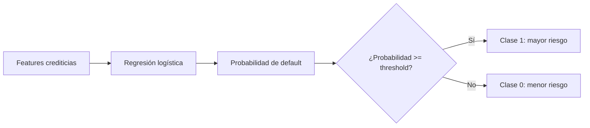
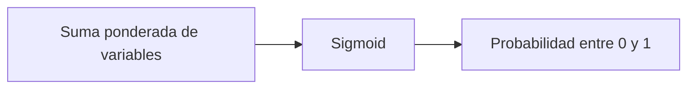
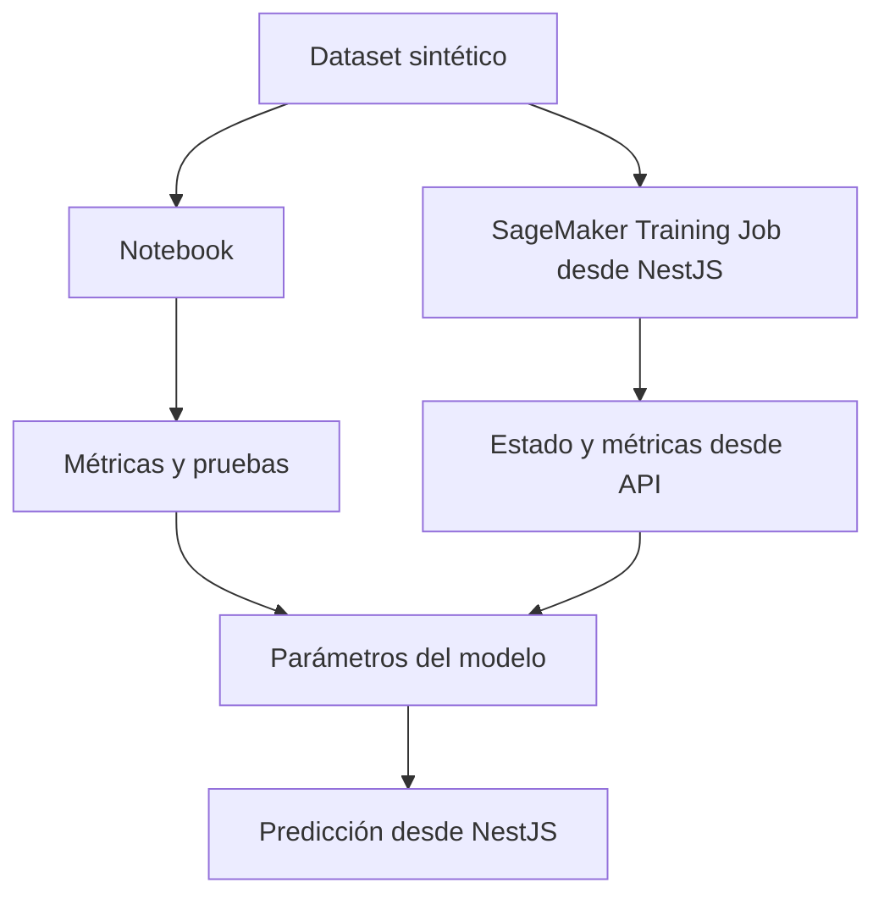

# Clase 6: Primer modelo de riesgo con regresión logística

| | |
|---|---|
| **Clase** | 6 de 11 |
| **Duración** | 3 horas |
| **Modelo** | Regresión logística para riesgo crediticio |
| **Objetivo del modelo** | Predecir probabilidad de incumplimiento |
| **Endpoints objetivo** | `POST /modulo1/clase06/sagemaker/train-risk`, `GET /modulo1/clase06/sagemaker/train-risk/:jobName`, `GET /modulo1/clase06/sagemaker/models/risk/metrics`, `POST /modulo1/clase06/models/risk/predict` |

## Objetivos

Al terminar esta sesión podrás:

- Explicar qué es un modelo de clasificación de riesgo.
- Entender conceptualmente cómo funciona una regresión logística.
- Entender términos como `features`, `target`, `label`, `training`, `test`, `probability`, `threshold`, `coefficients`, `intercept`, `scaler`, `AUC`, `precision` y `recall`.
- Crear un dataset sintético con reglas de negocio razonables.
- Entrenar el modelo de riesgo desde un notebook.
- Entrenar el modelo desde un endpoint NestJS usando SageMaker Training Jobs.
- Probar el modelo desde notebook y desde NestJS.

---

## Parte teórica

### 1. Qué problema resolveremos

En Clase 5 creamos variables listas para modelos:

```json
{
  "debt_to_income_ratio": 0.2118,
  "loan_to_value_ratio": 0.75,
  "payment_to_income_ratio": 0.3529,
  "credit_history_score": 80
}
```

En Clase 6 usaremos esas variables para responder:

```txt
¿Esta solicitud tiene mayor probabilidad de incumplimiento?
```

Este es un problema de **clasificación binaria**.

```txt
Clase 0: menor riesgo
Clase 1: mayor riesgo
```

El modelo no aprueba ni rechaza créditos. Solo devuelve una señal:

```json
{
  "default_probability": 0.27,
  "risk_label": "LOW"
}
```

### 2. Vocabulario esencial

Antes de entrenar, necesitamos entender varios términos que aparecen mucho en machine learning.

| Concepto | Traducción práctica | Qué significa |
|----------|---------------------|---------------|
| `feature` | variable de entrada | Columna que el modelo usa para aprender |
| `target` | objetivo | Columna que queremos predecir |
| `label` | etiqueta | Valor real de la respuesta en los datos históricos |
| `training` | entrenamiento | Proceso donde el modelo aprende desde ejemplos |
| `train set` | datos de entrenamiento | Parte del dataset usada para aprender |
| `test set` | datos de prueba | Parte separada para evaluar si aprendió bien |
| `prediction` | predicción | Respuesta del modelo para un caso |
| `probability` | probabilidad | Qué tan probable considera el modelo una clase |
| `threshold` | umbral | Punto de corte para convertir probabilidad en clase |
| `coefficient` | coeficiente | Peso que el modelo asigna a una variable |
| `intercept` | intercepto | Punto base de la fórmula del modelo |
| `scaler` | escalador | Transformación para poner variables en escalas comparables |
| `metric` | métrica | Número usado para evaluar el modelo |

En esta clase:

```txt
features = variables crediticias
target = default_flag
label = 0 o 1
```

### 3. Clasificación, regresión y clustering

En machine learning hay varios tipos de problemas.

| Tipo | Pregunta que responde | Ejemplo |
|------|------------------------|---------|
| Clasificación | ¿A qué clase pertenece? | Riesgo alto o bajo |
| Regresión | ¿Qué número esperamos? | Monto recomendado |
| Clustering | ¿Qué grupos aparecen naturalmente? | Segmentos de clientes |

En esta clase usamos clasificación:

```txt
Entrada: variables crediticias
Salida: probabilidad de default
```

En Clase 7 usaremos regresión para recomendar un monto.

---

## 4. Qué es regresión logística

La regresión logística se llama "regresión", pero se usa mucho para **clasificación binaria**.

Sirve para preguntas con dos clases:

- sí / no;
- fraude / no fraude;
- spam / no spam;
- mayor riesgo / menor riesgo;
- incumple / no incumple.

La regresión logística no devuelve primero una palabra. Devuelve una probabilidad.

```txt
Probabilidad de default = 0.73
```

Luego usamos un umbral:

```txt
Si probabilidad >= 0.50 -> mayor riesgo
Si probabilidad < 0.50 -> menor riesgo
```



### Cómo funciona conceptualmente

Imagina que el modelo recibe estas variables:

```json
{
  "debt_to_income_ratio": 0.50,
  "loan_to_value_ratio": 0.90,
  "payment_to_income_ratio": 0.45,
  "employment_stability_score": 35,
  "banking_capacity_score": 40,
  "credit_history_score": 45
}
```

El modelo hace tres ideas simples:

1. Mira cada variable.
2. Le asigna un peso a cada variable.
3. Combina todo para producir una probabilidad entre 0 y 1.

En lenguaje simple:

```txt
Variables que aumentan riesgo empujan la probabilidad hacia arriba.
Variables que reducen riesgo empujan la probabilidad hacia abajo.
```

Ejemplo conceptual:

| Variable | Valor | Efecto esperado |
|----------|-------|-----------------|
| `debt_to_income_ratio` alto | 0.50 | sube riesgo |
| `loan_to_value_ratio` alto | 0.90 | sube riesgo |
| `payment_to_income_ratio` alto | 0.45 | sube riesgo |
| `employment_stability_score` bajo | 35 | sube riesgo |
| `credit_history_score` bajo | 45 | sube riesgo |

Otro caso:

| Variable | Valor | Efecto esperado |
|----------|-------|-----------------|
| `debt_to_income_ratio` bajo | 0.18 | baja riesgo |
| `loan_to_value_ratio` moderado | 0.65 | baja riesgo |
| `payment_to_income_ratio` bajo | 0.20 | baja riesgo |
| `employment_stability_score` alto | 100 | baja riesgo |
| `credit_history_score` alto | 95 | baja riesgo |

### Qué son los coeficientes

Un coeficiente es el peso aprendido para una variable.

Ejemplo inventado:

| Feature | Coeficiente | Interpretación simple |
|---------|-------------|-----------------------|
| `debt_to_income_ratio` | `+1.8` | Si sube, aumenta el riesgo |
| `loan_to_value_ratio` | `+1.2` | Si sube, aumenta el riesgo |
| `credit_history_score` | `-0.9` | Si sube, reduce el riesgo |
| `employment_stability_score` | `-0.6` | Si sube, reduce el riesgo |

Signo positivo:

```txt
Más valor -> más probabilidad de clase 1
```

Signo negativo:

```txt
Más valor -> menos probabilidad de clase 1
```

En nuestro caso, clase 1 significa mayor riesgo o `default_flag = 1`.

### Qué es la función sigmoid

La regresión logística necesita convertir un número cualquiera en una probabilidad entre 0 y 1.

Para eso usa una función llamada `sigmoid`.

```txt
número muy negativo -> probabilidad cercana a 0
número cercano a 0 -> probabilidad cercana a 0.5
número muy positivo -> probabilidad cercana a 1
```



No necesitas memorizar la fórmula, pero sí la idea:

> La sigmoid convierte el puntaje interno del modelo en probabilidad.

### Qué es el threshold

El threshold, o umbral, convierte probabilidad en clase.

Si usamos `0.50`:

| Probabilidad | Clase |
|--------------|-------|
| `0.18` | menor riesgo |
| `0.49` | menor riesgo |
| `0.50` | mayor riesgo |
| `0.82` | mayor riesgo |

En un banco real, ese umbral no se elige al azar. Se ajusta según política, apetito de riesgo, regulación y costo de equivocarse.

En el curso usamos `0.50` para aprender el flujo.

---

## 5. Cómo se crearon los datos sintéticos

No tenemos miles de expedientes reales con resultado histórico. Por eso usamos un dataset sintético.

Pero no queremos números aleatorios sin sentido. Queremos datos generados con una lógica razonable.

El archivo usado es:

```txt
generate_synthetic_mortgage_dataset.py
```

Este script crea solicitudes de crédito simuladas con columnas como:

- ingreso neto mensual;
- deuda mensual;
- valor del inmueble;
- monto solicitado;
- plazo solicitado;
- cantidad de créditos activos;
- mora previa;
- antigüedad laboral;
- saldo promedio;
- ratios y scores;
- `default_flag`;
- `recommended_amount`.

### Relaciones que forzamos en los datos

El script está construido para que ciertas relaciones tengan sentido:

| Regla de negocio simulada | Efecto esperado |
|---------------------------|-----------------|
| Más deuda sobre ingreso | más probabilidad de default |
| Más cuota sobre ingreso | más probabilidad de default |
| Mayor LTV | más probabilidad de default |
| Mora previa | más probabilidad de default |
| Muchos créditos activos | más probabilidad de default |
| Más antigüedad laboral | menos probabilidad de default |
| Mejor historial | menos probabilidad de default |
| Mejor capacidad bancaria | menos probabilidad de default |

Ejemplo:

```txt
Si una persona tiene mucha deuda, poca estabilidad y mora previa,
el script tiende a marcar mayor probabilidad de default.
```

Otro ejemplo:

```txt
Si una persona tiene bajo endeudamiento, buen historial y estabilidad laboral,
el script tiende a marcar menor probabilidad de default.
```

### Por qué esto importa

Si entrenamos con datos completamente aleatorios, el modelo no puede aprender una relación útil.

```txt
Datos sin lógica -> modelo sin lógica
```

Si entrenamos con datos que tienen patrones razonables, podemos verificar que el modelo aprendió esos patrones.

```txt
Datos con señales -> modelo capaz de responder a esas señales
```

Esto sigue siendo un laboratorio. No representa una política real de crédito.

### Cómo verificaremos que el modelo aprendió

Después de entrenar, probaremos dos casos:

Caso de menor riesgo:

```json
{
  "debt_to_income_ratio": 0.18,
  "loan_to_value_ratio": 0.60,
  "payment_to_income_ratio": 0.20,
  "employment_stability_score": 100,
  "banking_capacity_score": 90,
  "credit_history_score": 95
}
```

Caso de mayor riesgo:

```json
{
  "debt_to_income_ratio": 0.62,
  "loan_to_value_ratio": 0.95,
  "payment_to_income_ratio": 0.55,
  "employment_stability_score": 35,
  "banking_capacity_score": 30,
  "credit_history_score": 40
}
```

Esperamos que el segundo caso tenga mayor `default_probability`.

---

## Parte práctica

La práctica tendrá dos caminos:

1. Notebook: entrenar y probar el modelo de forma visible.
2. NestJS: iniciar entrenamiento, consultar estado, consultar métricas y probar una predicción desde la API.



### 1. Instala librerías para notebook o local

Si trabajas localmente:

```bash
python3 -m pip install numpy pandas scikit-learn joblib
```

Si trabajas en notebook:

```python
%pip install numpy pandas scikit-learn joblib
```

### 2. Genera el dataset sintético

Desde la raíz del proyecto:

```bash
python3 generate_synthetic_mortgage_dataset.py \
  --rows 2000 \
  --output synthetic_mortgage_dataset.csv
```

El CSV tendrá columnas como:

```txt
debt_to_income_ratio
loan_to_value_ratio
payment_to_income_ratio
employment_stability_score
banking_capacity_score
credit_history_score
default_flag
recommended_amount
```

Para esta clase usaremos `default_flag`.

```txt
default_flag = 0 -> menor riesgo
default_flag = 1 -> mayor riesgo
```

### 3. Explora el dataset en notebook

```python
import pandas as pd

df = pd.read_csv("synthetic_mortgage_dataset.csv")
df.head()
```

Revisa distribución de la etiqueta:

```python
df["default_flag"].value_counts(normalize=True)
```

Revisa las variables principales:

```python
df[[
    "debt_to_income_ratio",
    "loan_to_value_ratio",
    "payment_to_income_ratio",
    "employment_stability_score",
    "banking_capacity_score",
    "credit_history_score",
    "default_flag",
]].describe()
```

Compara promedios por clase:

```python
df.groupby("default_flag")[[
    "debt_to_income_ratio",
    "loan_to_value_ratio",
    "payment_to_income_ratio",
    "employment_stability_score",
    "banking_capacity_score",
    "credit_history_score",
]].mean()
```

Aquí deberías observar algo importante:

```txt
Los casos con default_flag = 1 deberían tener más endeudamiento
y peores scores en promedio.
```

### 4. Entrena regresión logística en notebook

```python
from sklearn.model_selection import train_test_split
from sklearn.pipeline import Pipeline
from sklearn.preprocessing import StandardScaler
from sklearn.linear_model import LogisticRegression
from sklearn.metrics import roc_auc_score, confusion_matrix, precision_score, recall_score

features = [
    "debt_to_income_ratio",
    "loan_to_value_ratio",
    "payment_to_income_ratio",
    "employment_stability_score",
    "banking_capacity_score",
    "credit_history_score",
]

X = df[features]
y = df["default_flag"]

X_train, X_test, y_train, y_test = train_test_split(
    X,
    y,
    test_size=0.2,
    random_state=42,
    stratify=y,
)

model = Pipeline([
    ("scaler", StandardScaler()),
    ("logistic", LogisticRegression(class_weight="balanced", max_iter=1000)),
])

model.fit(X_train, y_train)
```

Qué pasó aquí:

- `features`: columnas de entrada;
- `X`: tabla con variables;
- `y`: respuesta real;
- `train_test_split`: separa datos de entrenamiento y prueba;
- `StandardScaler`: pone variables en escalas comparables;
- `LogisticRegression`: modelo de clasificación;
- `fit`: entrena el modelo.

### 5. Evalúa el modelo

```python
probabilities = model.predict_proba(X_test)[:, 1]
predictions = (probabilities >= 0.5).astype(int)

auc = roc_auc_score(y_test, probabilities)
precision = precision_score(y_test, predictions)
recall = recall_score(y_test, predictions)
matrix = confusion_matrix(y_test, predictions)

print("AUC:", round(auc, 4))
print("Precision:", round(precision, 4))
print("Recall:", round(recall, 4))
print(matrix)
```

Conceptos:

| Métrica | Qué significa |
|---------|---------------|
| AUC | Qué tan bien separa casos de menor y mayor riesgo |
| Precision | De los casos marcados como riesgo, cuántos realmente eran riesgo |
| Recall | De los casos de riesgo reales, cuántos detectó |
| Matriz de confusión | Tabla de aciertos y errores |

Matriz de confusión:

```txt
[[verdaderos_bajo_riesgo, falsos_alto_riesgo],
 [falsos_bajo_riesgo, verdaderos_alto_riesgo]]
```

### 6. Prueba dos casos extremos en notebook

```python
low_risk = pd.DataFrame([{
    "debt_to_income_ratio": 0.18,
    "loan_to_value_ratio": 0.60,
    "payment_to_income_ratio": 0.20,
    "employment_stability_score": 100,
    "banking_capacity_score": 90,
    "credit_history_score": 95,
}])

high_risk = pd.DataFrame([{
    "debt_to_income_ratio": 0.62,
    "loan_to_value_ratio": 0.95,
    "payment_to_income_ratio": 0.55,
    "employment_stability_score": 35,
    "banking_capacity_score": 30,
    "credit_history_score": 40,
}])

print("Low risk probability:", model.predict_proba(low_risk)[0][1])
print("High risk probability:", model.predict_proba(high_risk)[0][1])
```

La probabilidad del segundo caso debería ser mayor.

### 7. Entrena usando el script del curso

El script del curso es:

```txt
train_risk_logistic.py
```

Ejecuta:

```bash
python3 train_risk_logistic.py \
  --train synthetic_mortgage_dataset.csv \
  --model-dir model-risk \
  --metrics risk_metrics.json \
  --model-params risk_model_params.json
```

Este script:

- lee el CSV;
- separa entrenamiento y prueba;
- escala variables;
- entrena regresión logística;
- calcula métricas;
- guarda `model.joblib`;
- guarda `risk_metrics.json`;
- guarda `risk_model_params.json`.

`risk_model_params.json` contiene una versión simple del modelo para que NestJS pueda calcular una predicción:

```json
{
  "model_type": "logistic_regression_classifier",
  "target": "default_flag",
  "features": [
    "debt_to_income_ratio",
    "loan_to_value_ratio",
    "payment_to_income_ratio",
    "employment_stability_score",
    "banking_capacity_score",
    "credit_history_score"
  ],
  "threshold": 0.5,
  "scaler": {
    "mean": {},
    "scale": {}
  },
  "coefficients": {},
  "intercept": -0.15
}
```

Sube métricas y parámetros a S3:

```bash
aws s3 cp synthetic_mortgage_dataset.csv s3://TU_BUCKET/ml/synthetic/synthetic_mortgage_dataset.csv
aws s3 cp risk_metrics.json s3://TU_BUCKET/ml/metrics/risk_metrics.json
aws s3 cp risk_model_params.json s3://TU_BUCKET/ml/models/risk/risk_model_params.json
```

### 8. Variables de entorno

Instala el SDK de SageMaker:

```bash
npm install @aws-sdk/client-sagemaker
```

Agrega a `.env`:

```env
SAGEMAKER_RISK_TRAINING_IMAGE=
SAGEMAKER_ROLE_ARN=
SAGEMAKER_BUCKET=TU_BUCKET
SAGEMAKER_RISK_METRICS_KEY=ml/metrics/risk_metrics.json
SAGEMAKER_RISK_MODEL_PARAMS_KEY=ml/models/risk/risk_model_params.json
```

El endpoint de NestJS usa `CreateTrainingJob`. Para que SageMaker ejecute `train_risk_logistic.py`, la imagen indicada en `SAGEMAKER_RISK_TRAINING_IMAGE` debe contener o ejecutar ese script.

En esta clase hay dos niveles:

| Nivel | Qué hacemos |
|-------|-------------|
| Notebook/local | Entrenamos y probamos rápidamente |
| NestJS + SageMaker | Iniciamos entrenamiento asíncrono y consultamos estado |

### 9. Crea `SageMakerTrainingService`

Archivo: `src/modulo1/clase06/sagemaker-training.service.ts`

```typescript
import { Injectable } from '@nestjs/common';
import { ConfigService } from '@nestjs/config';
import {
  CreateTrainingJobCommand,
  DescribeTrainingJobCommand,
  SageMakerClient,
} from '@aws-sdk/client-sagemaker';

@Injectable()
export class SageMakerTrainingService {
  private readonly client: SageMakerClient;

  constructor(private readonly config: ConfigService) {
    this.client = new SageMakerClient({
      region: this.config.getOrThrow<string>('AWS_REGION'),
      credentials: {
        accessKeyId: this.config.getOrThrow<string>('AWS_ACCESS_KEY_ID'),
        secretAccessKey: this.config.getOrThrow<string>('AWS_SECRET_ACCESS_KEY'),
      },
    });
  }

  async startRiskTraining() {
    const bucket = this.config.getOrThrow<string>('SAGEMAKER_BUCKET');
    const jobName = `risk-logistic-${Date.now()}`;

    await this.client.send(
      new CreateTrainingJobCommand({
        TrainingJobName: jobName,
        RoleArn: this.config.getOrThrow<string>('SAGEMAKER_ROLE_ARN'),
        AlgorithmSpecification: {
          TrainingImage: this.config.getOrThrow<string>(
            'SAGEMAKER_RISK_TRAINING_IMAGE',
          ),
          TrainingInputMode: 'File',
        },
        InputDataConfig: [
          {
            ChannelName: 'train',
            DataSource: {
              S3DataSource: {
                S3DataType: 'S3Prefix',
                S3Uri: `s3://${bucket}/ml/synthetic/`,
                S3DataDistributionType: 'FullyReplicated',
              },
            },
          },
        ],
        OutputDataConfig: {
          S3OutputPath: `s3://${bucket}/ml/models/risk/`,
        },
        ResourceConfig: {
          InstanceType: 'ml.m5.large',
          InstanceCount: 1,
          VolumeSizeInGB: 10,
        },
        StoppingCondition: {
          MaxRuntimeInSeconds: 3600,
        },
      }),
    );

    return { jobName };
  }

  async describeTrainingJob(jobName: string) {
    const response = await this.client.send(
      new DescribeTrainingJobCommand({ TrainingJobName: jobName }),
    );

    return {
      jobName,
      status: response.TrainingJobStatus,
      failureReason: response.FailureReason,
      trainingStartTime: response.TrainingStartTime,
      trainingEndTime: response.TrainingEndTime,
      modelArtifacts: response.ModelArtifacts?.S3ModelArtifacts,
    };
  }
}
```

### 10. Crea `Clase06Service`

Archivo: `src/modulo1/clase06/clase06.service.ts`

```typescript
import { Injectable } from '@nestjs/common';
import { ConfigService } from '@nestjs/config';
import { GetObjectCommand, S3Client } from '@aws-sdk/client-s3';
import { SageMakerTrainingService } from './sagemaker-training.service';

type RiskFeatures = {
  debt_to_income_ratio: number;
  loan_to_value_ratio: number;
  payment_to_income_ratio: number;
  employment_stability_score: number;
  banking_capacity_score: number;
  credit_history_score: number;
};

type RiskModelParams = {
  features: (keyof RiskFeatures)[];
  threshold: number;
  scaler: {
    mean: Record<string, number>;
    scale: Record<string, number>;
  };
  coefficients: Record<string, number>;
  intercept: number;
};

@Injectable()
export class Clase06Service {
  private readonly s3: S3Client;

  constructor(
    private readonly config: ConfigService,
    private readonly training: SageMakerTrainingService,
  ) {
    this.s3 = new S3Client({
      region: this.config.getOrThrow<string>('AWS_REGION'),
      credentials: {
        accessKeyId: this.config.getOrThrow<string>('AWS_ACCESS_KEY_ID'),
        secretAccessKey: this.config.getOrThrow<string>('AWS_SECRET_ACCESS_KEY'),
      },
    });
  }

  async startRiskTraining() {
    return await this.training.startRiskTraining();
  }

  async getRiskTrainingStatus(jobName: string) {
    return await this.training.describeTrainingJob(jobName);
  }

  async getRiskMetrics() {
    return await this.readJson(
      this.config.getOrThrow<string>('SAGEMAKER_RISK_METRICS_KEY'),
    );
  }

  async predictRisk(features: RiskFeatures) {
    const model = (await this.readJson(
      this.config.getOrThrow<string>('SAGEMAKER_RISK_MODEL_PARAMS_KEY'),
    )) as RiskModelParams;

    let score = model.intercept;

    for (const featureName of model.features) {
      const rawValue = features[featureName];
      const mean = model.scaler.mean[featureName];
      const scale = model.scaler.scale[featureName] || 1;
      const standardizedValue = (rawValue - mean) / scale;
      score += standardizedValue * model.coefficients[featureName];
    }

    const defaultProbability = 1 / (1 + Math.exp(-score));
    const threshold = model.threshold ?? 0.5;

    return {
      defaultProbability: Number(defaultProbability.toFixed(4)),
      threshold,
      riskLabel: defaultProbability >= threshold ? 'HIGH' : 'LOW',
      modelType: 'logistic_regression_classifier',
      features,
    };
  }

  private async readJson(key: string) {
    const response = await this.s3.send(
      new GetObjectCommand({
        Bucket: this.config.getOrThrow<string>('SAGEMAKER_BUCKET'),
        Key: key,
      }),
    );

    return JSON.parse(await response.Body!.transformToString());
  }
}
```

### 11. Crea el controller

Archivo: `src/modulo1/clase06/clase06.controller.ts`

```typescript
import { Body, Controller, Get, Param, Post, UseGuards } from '@nestjs/common';
import { ApiKeyGuard } from '../../auth/guards/api-key.guard';
import { Clase06Service } from './clase06.service';

@Controller('modulo1/clase06')
@UseGuards(ApiKeyGuard)
export class Clase06Controller {
  constructor(private readonly clase06: Clase06Service) {}

  @Post('sagemaker/train-risk')
  async trainRisk() {
    return await this.clase06.startRiskTraining();
  }

  @Get('sagemaker/train-risk/:jobName')
  async getTrainingStatus(@Param('jobName') jobName: string) {
    return await this.clase06.getRiskTrainingStatus(jobName);
  }

  @Get('sagemaker/models/risk/metrics')
  async getRiskMetrics() {
    return await this.clase06.getRiskMetrics();
  }

  @Post('models/risk/predict')
  async predictRisk(
    @Body()
    body: {
      debt_to_income_ratio: number;
      loan_to_value_ratio: number;
      payment_to_income_ratio: number;
      employment_stability_score: number;
      banking_capacity_score: number;
      credit_history_score: number;
    },
  ) {
    return await this.clase06.predictRisk(body);
  }
}
```

### 12. Actualiza `Modulo1Module`

Agrega:

```typescript
import { Clase06Controller } from './clase06/clase06.controller';
import { Clase06Service } from './clase06/clase06.service';
import { SageMakerTrainingService } from './clase06/sagemaker-training.service';
```

Luego registra:

```typescript
controllers: [
  Clase01Controller,
  Clase02Controller,
  Clase03Controller,
  Clase04Controller,
  Clase05Controller,
  Clase06Controller,
],
providers: [
  Clase01Service,
  Clase02Service,
  Clase03Service,
  Clase04Service,
  Clase05Service,
  Clase06Service,
  GlueService,
  SageMakerTrainingService,
  TextractService,
],
```

### 13. Prueba desde NestJS

Iniciar entrenamiento:

```bash
curl -X POST http://localhost:3000/modulo1/clase06/sagemaker/train-risk \
  -H "x-api-key: test1" \
  -H "x-api-secret: pass1"
```

Consultar estado:

```bash
curl http://localhost:3000/modulo1/clase06/sagemaker/train-risk/JOB_NAME \
  -H "x-api-key: test1" \
  -H "x-api-secret: pass1"
```

Consultar métricas:

```bash
curl http://localhost:3000/modulo1/clase06/sagemaker/models/risk/metrics \
  -H "x-api-key: test1" \
  -H "x-api-secret: pass1"
```

Probar predicción de menor riesgo:

```bash
curl -X POST http://localhost:3000/modulo1/clase06/models/risk/predict \
  -H "Content-Type: application/json" \
  -H "x-api-key: test1" \
  -H "x-api-secret: pass1" \
  -d '{
    "debt_to_income_ratio": 0.18,
    "loan_to_value_ratio": 0.60,
    "payment_to_income_ratio": 0.20,
    "employment_stability_score": 100,
    "banking_capacity_score": 90,
    "credit_history_score": 95
  }'
```

Probar predicción de mayor riesgo:

```bash
curl -X POST http://localhost:3000/modulo1/clase06/models/risk/predict \
  -H "Content-Type: application/json" \
  -H "x-api-key: test1" \
  -H "x-api-secret: pass1" \
  -d '{
    "debt_to_income_ratio": 0.62,
    "loan_to_value_ratio": 0.95,
    "payment_to_income_ratio": 0.55,
    "employment_stability_score": 35,
    "banking_capacity_score": 30,
    "credit_history_score": 40
  }'
```

La segunda respuesta debería tener mayor `defaultProbability`.

## Entrega

- Captura del notebook entrenando regresión logística.
- Resultado de métricas (`AUC`, `precision`, `recall`, matriz de confusión).
- Evidencia de `risk_metrics.json`.
- Evidencia de `risk_model_params.json`.
- Prueba desde NestJS con un caso de menor riesgo y uno de mayor riesgo.
- Explicación corta de por qué el segundo caso devuelve mayor probabilidad.

## Recursos

- [Scikit-learn LogisticRegression](https://scikit-learn.org/stable/modules/generated/sklearn.linear_model.LogisticRegression.html)
- [Scikit-learn StandardScaler](https://scikit-learn.org/stable/modules/generated/sklearn.preprocessing.StandardScaler.html)
- [Amazon SageMaker Training Jobs](https://docs.aws.amazon.com/sagemaker/latest/dg/how-it-works-training.html)
